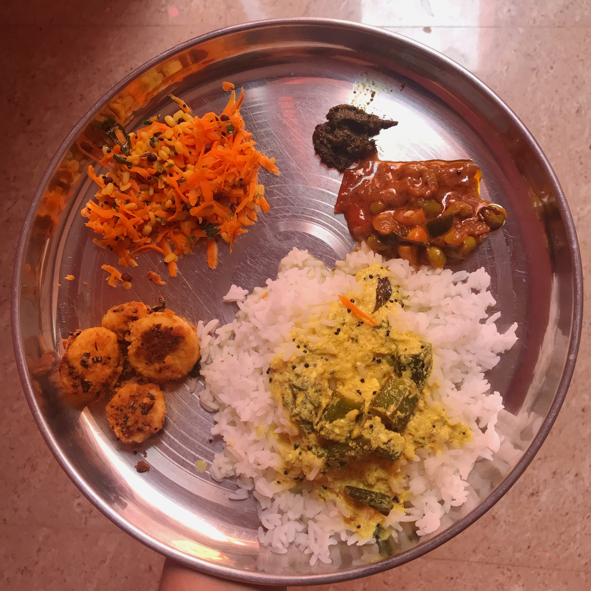
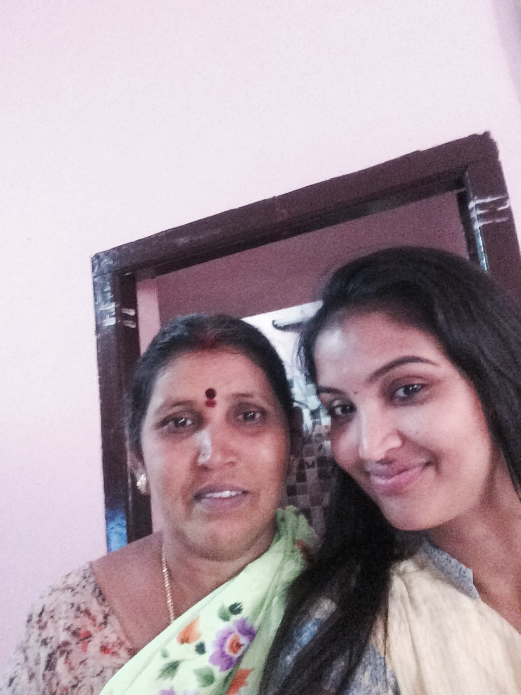

## To the most beautiful women in my life

Every year mother’s day comes and goes. And, I try to send you some gifts and virtual love sitting on the other end of the world. But this year, I feel very happy for that one moment I created when I visited India this year :) Yeah, it's the lunch that I made for you <3. This is something very very little I can do for all that you’ve done for me. Love you ma ever and ever.

I’ve taken you for granted at times, shouted at you for things and never been grateful for all that you have done to me at my teen days. But things changed, and I realized that you’re my root, the foundation. And, that I’m nowhere without you. I respect you immensely for everything you are and giving me a life! All I wish now is to be at least half of what you were to me to my future kids.

> வேர் இல்லாத மரம்போல்  
> என்னை நீ பூமியில் நட்டாயே  
> ஊர் கண் என் மேல் பட்டால்  
> உன் உயிர் நோக துடித்தாயே  
> உலகத்தின் பந்தங்கள் எல்லாம்  
> நீ சொல்லி தந்தாயே  
> பிறப்புக்கும் இறப்புக்கும் இடையில்  
> வழி நடத்திச் சென்றாயே  
> உனக்கே ஓர் தொட்டில் கட்டி  
> நானே தாயாய் மாறிட வேண்டும்  

Happy mother’s day Amma!

With love,   
Anjali