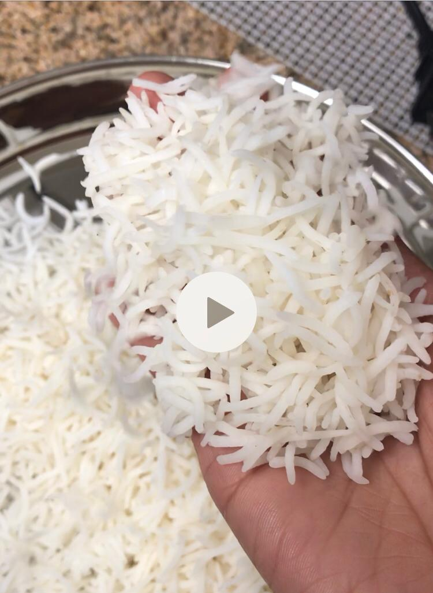

## Low carb white rice / De-starched rice / Vadicha sadam (வடிச்ச சாதம்)

- Calling it starch free is misleading as it not removing the starch 100%, hence I’m gonna call it low carb rice. Again, there are quite a lot of low carb rice varieties available e.g. Cauliflower rice, Broccoli rice, etc. So, please do not get confused. I’m talking about white rice :)
- I eat rice in one or the other form almost everyday. But, I don’t need that much carbs for my daily activities (sitting and coding most of the time). That’s why I’m opting to reduce starch.
- Some people think removing starch removes whole lot of nutrients. So, please go with what works for you.

### How to reduce starch from rice?

Looks like there are various ways to do it. I follow the **traditional old school cooking** that my mom and her mom followed. *#oldisthenewblack* :P

Here are the steps: (for 1 cup rice)
> 
> 1. Wash the rice and soak it for 10-15 mins.
> 2. Heat 4-5 cups of water in a vessel. Once the water starts boiling, add the soaked rice.
> 3. Cook in a medium flame for about 20-30 mins.
> 4. Check for the softness of the rice by pressing it a little. 
> 5. Once cooked, use the filter plates to filter out the water with a help of a cloth to another vessel. Let it sit like that for few mins until all the water is completely drained.
> 6. The water you filtered out (liquid starch) is good for health. You can drink it once in a while.

And, this is how it looks:

### More details
[*[source: food.ndtv.com]*](https://food.ndtv.com)

Starch makes up for most part of our diet, majorly because most foods contain starch made up of sugar and carbohydrates. Everyday foods like potato, corn, peas, sweet potato, rice et al can all be high in starch. Starch metabolizes quickly, causing to increase blood sugar levels right after eating. Although starchy foods make for an important source of energy, but should be consumed in moderation in order to attain benefits from them. Many health experts do not recommend eating starchy foods on a daily basis as they may hinder digestion and can spike blood sugar, which may be hazardous to diabetics.

